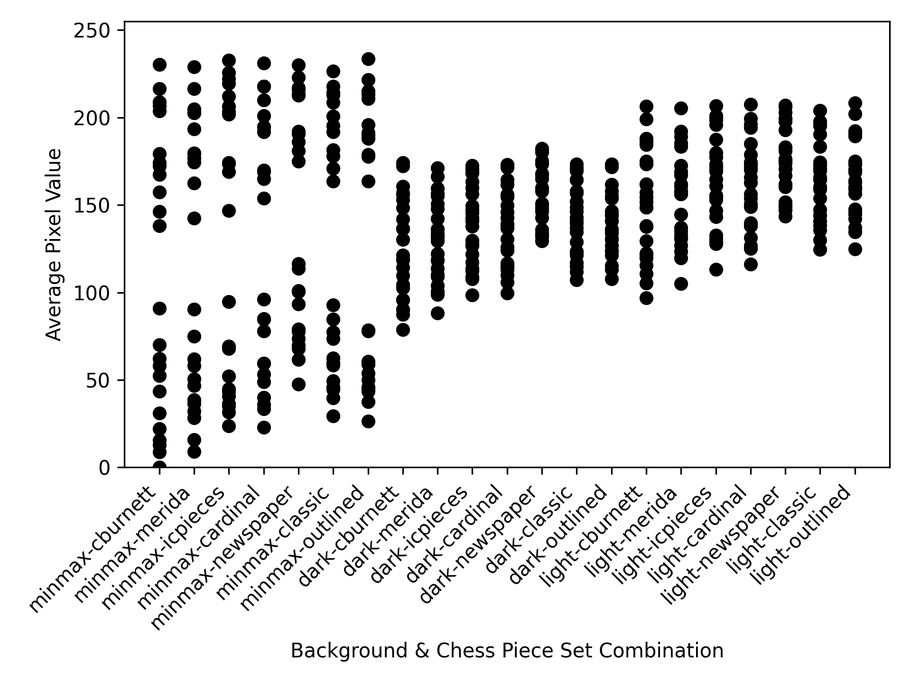

# Chess Board Colours & Chess Piece Sets

Goal is the generation of a suitable combination of a chess piece set together with a set of background colours.
The result should offer a sufficient range of average pixel grey values to achieve satisfactory amounts of constrast in the final mosaic.
Ideally, both high and low brightness values are covered to more realistily preserve the original shades.

## Background Shade Combinations

Different backgrounds shadings were introduced as the varience between the average grey values of the chess pieces alone.
Colouring the transparent backgrounds with two distinct colours gives a natural way to overcome these limitations.
At the time, optional padding may be introduced to the backdrop in order to further tweak the average pixel values.

| Name   | White              | Black              | Source        |
| :----: | :----------------: | :----------------: | :-----------: |
| minmax | rgb(255, 255, 255) | rgb(0, 0, 0)       | min & max RGB |
| dark   | rgb(169, 169, 169) | rgb(134, 134, 134) | lichess.org   |
| light  | rgb(220, 220, 220) | rgb(171, 171, 171) | chess.com     |

## Chess Piece Sets

The `cburnett` and `merida` piece sets are two popular choices among chess players for their online games.
However, they do not play nicely with pure black and white background shadings.
Thus, the rest of the piece sets are compromised of outlined pieces that may be used with any background colour while still providing a sufficient contrast.
Here, `outlined` is based on the `cburnett` variant, which was modified to include a small white outline to make it compatible with the `minmax` colours.

| Name      | Source      | Outlined? |
| :-------: | :---------: | :-------: |
| cburnett  | lichess.org | no        |
| merida    | lichess.org | no        |
| icpieces  | lichess.org | yes       |
| cardinal  | lichess.org | yes       |
| newspaper | chess.com   | yes       |
| classic   | chess24.org | yes       |
| outlined  | custom      | yes       |

## Analysis Results

While the `minmax-{cburnett,merida}` configurations exhibit the largest range of average pixel values, these two piece sets do not possess outlined pieces.
Thus, they cannot be chosen directly for mosaic generation.
Although neither configuration option is able to completely cover medium levels of brightness, the remaining `minmax` designs all are assumed to provide a perfectly acceptible range of brightnesses.
As `minmax-{cardinal,newspaper}` cover the smallest and largest range of average pixel values, these two are selected - and partially due to personal preference 😉

For the `dark` and `light` backgrounds, the average pixel values each lie much closely packed together compared to the `minmax` results.
Neither option achieves as dark or light shades as the `minmax` versions are able to.
Unfortunately, adding additional padding around the edges cannot amend these observations either as the current brightness values already largely fall into the range of the respective background colours.
The best alternatives from the given set of combinations are `{dark,light}-cburnett`.

## Conclusion

The four best fitting combinations of a chess piece set together with a set of background colours are:

- `minmax-cardinal`
- `minmax-newspaper`
- `dark-cburnett`
- `light-cburnett`

Rudimentary experiments have shown that `dark-cburnett`, `light-cburnett`, and `minmax-newspaper` produce the most visually appealing mosaics whereas the high contrast in `minmax-cardinal` does not have the desired qualitative effect.
Note however, that the `minmax-newspaper` results are signficiantly larger in byte size than the other two `cburnett` variants.
Thus, they might not be as suitable for sharing.
