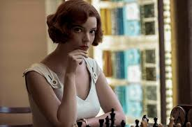
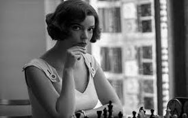

# Opt Art: Chess Piece Mosaics

This work is a mini research project related to the contents of the OR1 lecture by Prof. Dr. Lübbecke of the [Operations Research chair][1] at the RWTH Aachen University and adopts principles presented in the book "[Opt Art: From Mathematical Optimization to Visual Design][2]" by Robert Bosch.

Mosaic of current world chess champion Magnus Carlsen with a FIDE classical time rating of 2847 ELO (as of 4th March 2021) using 2847 complete chess piece sets.
Half of the total amount of each piece received a light and the other half a dark background shade.

  

Mosaic of Beth Harmon (played by Anya Taylor-Joy) from the 2020 Netflix series "Queen's Gambit" using 2020 complete chess piece sets.
Half of the total amount of each piece received a light and the other half a dark background shade.

  

## Setup & Usage

```sh
# the tested python version can be found in .python-version
python3 -m venv venv
. venv/bin/activate
# manually install the correct version of gurobipy before continuing with the other dependencies
pip3 install -r requirements.txt
# adjust the parameters for the mosaic manually in Prototype.py
# - desired target image: target_path
# - desired number of complete chess piece sets: num_sets
# - the default piece set and background combination should work fine in the majority of cases
# --> for customization consult findings in Brightness-Analysis.md
python3 Prototype.py
# - target greyscale image: Target.png
# - output mosaic: Mosaic.png
```

- Note on limitations: As there is a fixed number of mosaic tiles which has to be used in the final result, it is not possible to model arbitrary aspect ratios for a specific `num_sets` value. Thus, if the output mosaic looks distorted try your luck again with a different `num_sets` value.

## Extension Ideas

- Enable input parameters via CLI arguments or JSON files
- Automate best `num_sets` value search for a given predefined set of desirable options
- Consider adding blank board tiles which enables the generation of mosaics from individual board positions or complete games
- Add additional LP constraints to prevent the same piece configuration being placed adjacent to itself
- Add additional LP constraints to construct an actual checkerboard pattern in the background

## Attributions

- Thanks to everyone who makes open-source software like the used Python packages or [imagemagick][6] possible
- Thanks to [Gurobi][3] for their free academic licenses
- Thanks to the multitude of free online chess platforms namely [lichess.org][7], [chess.com][8], and [chess24.com][9] among others
- The original image of Magnus Carlsen from his own [website][4]
- The original image of Beth Harmon (played by Anya Taylor-Joy) from this [news article][5]

[1]: https://www.or.rwth-aachen.de
[2]: https://press.princeton.edu/titles/13702.html
[3]: https://www.gurobi.com
[4]: https://magnuscarlsen.com
[5]: https://www.cnet.com/news/the-queens-gambit-on-netflix-ending-explained-and-all-your-questions-answered/
[6]: https://imagemagick.org
[7]: https://lichess.org
[8]: https://www.chess.com
[9]: https://chess24.com
